> 

# 🦄Design WanAndroid

## Compose化部分页面
目前暂有：主题选择界面

## 界面：
**原WanAndroid开放的Api功能均已实现**

App内通篇全采用[Material Design 3](https://m3.material.io/)风格，拒绝半完成式Material带来的UI的割裂感。

所有Icon取自[Material Symbols](https://fonts.google.com/icons)，统一而规范的设计。

主题色遵循[Material3 Color system](https://m3.material.io/styles/color/the-color-system/key-colors-tones)。
- PrimaryColor, On-primary, Primary container, On-primary container
- SecondaryColor 同上
- TertiaryColor 

	
#### 截图展示
----

| 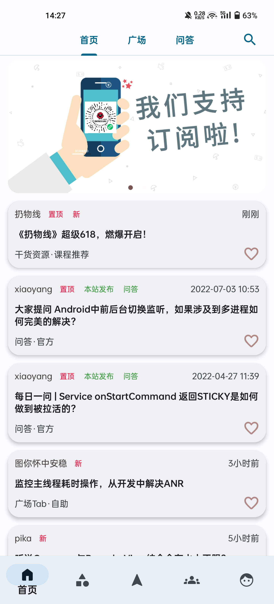 | 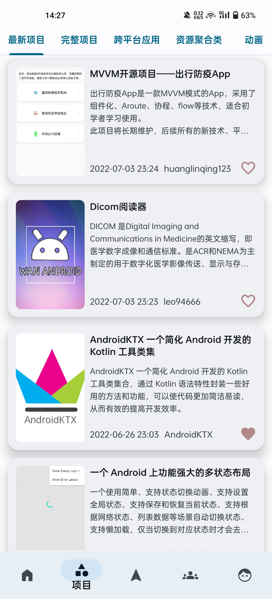 | 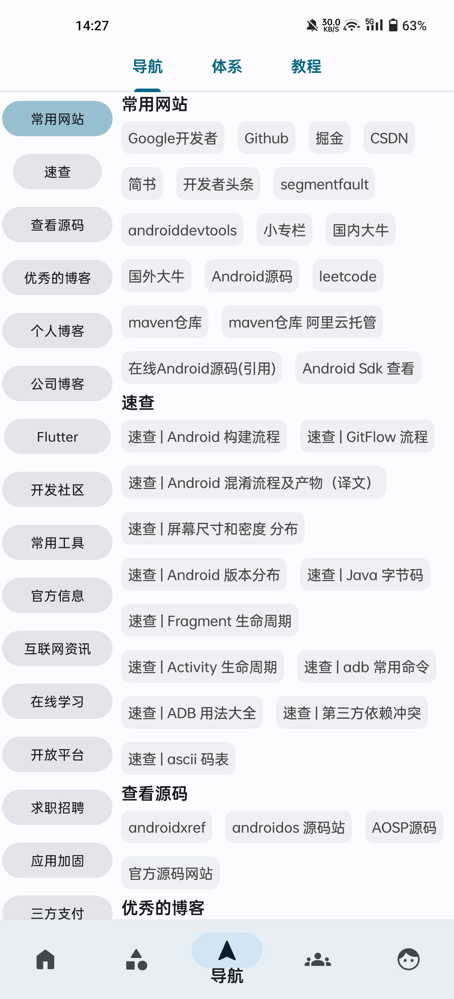 | 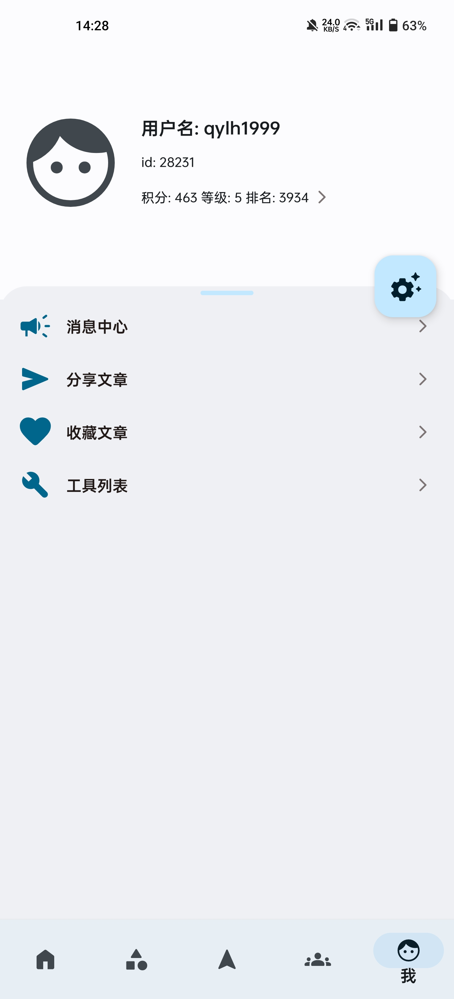 |
| --- | --- | --- | --- |
| 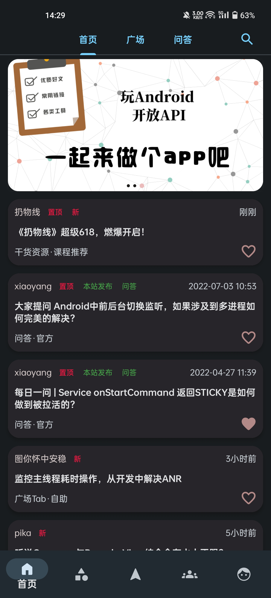 | 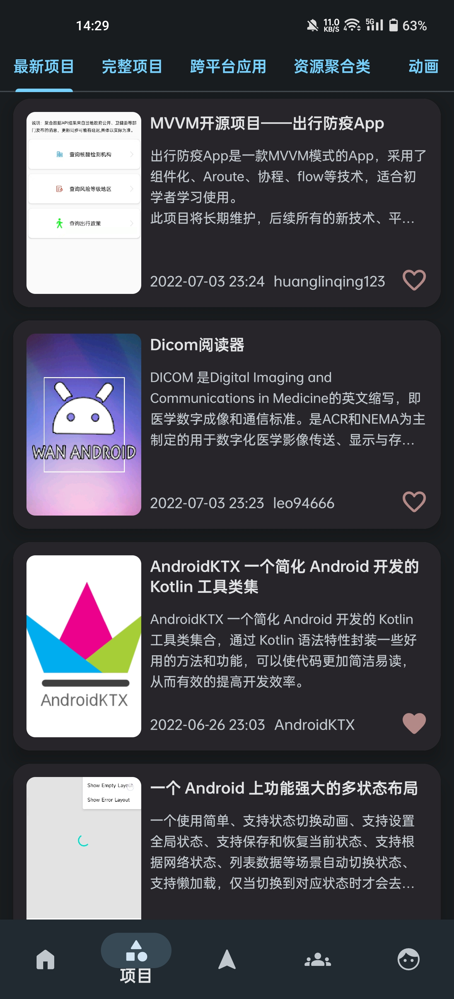 | 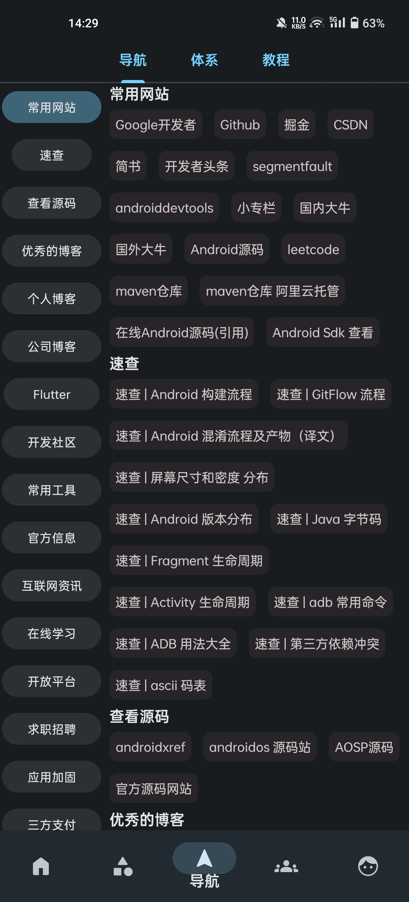 | 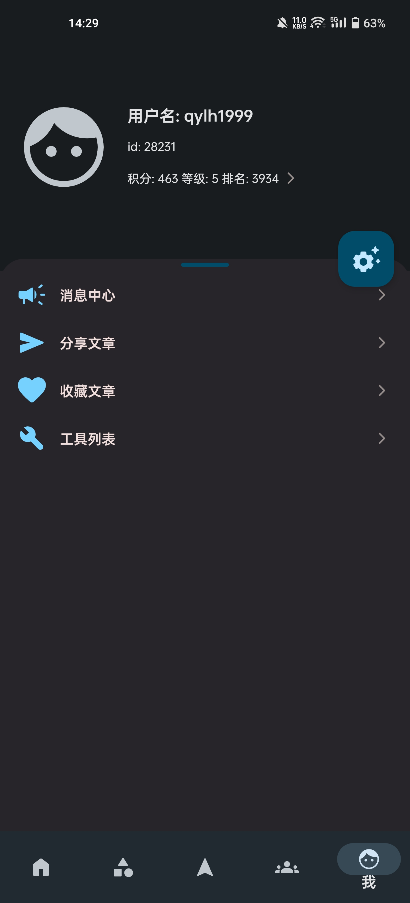 |
| 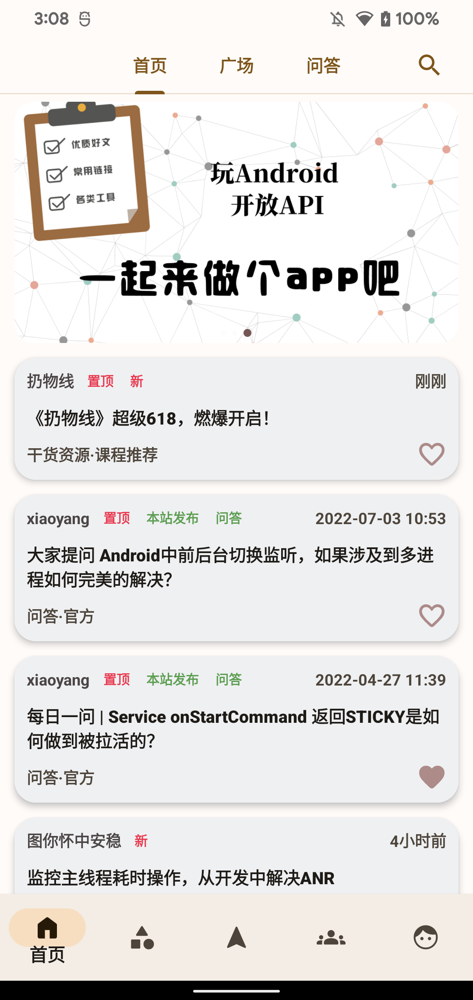 | 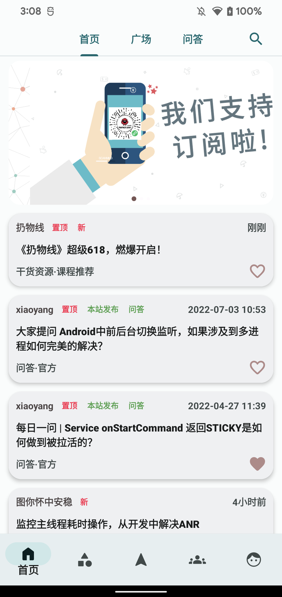 | 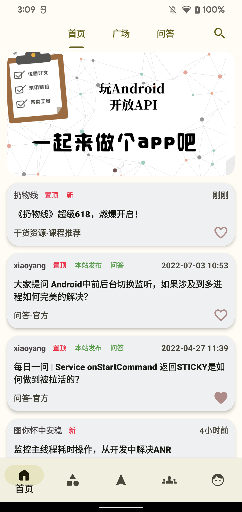 | 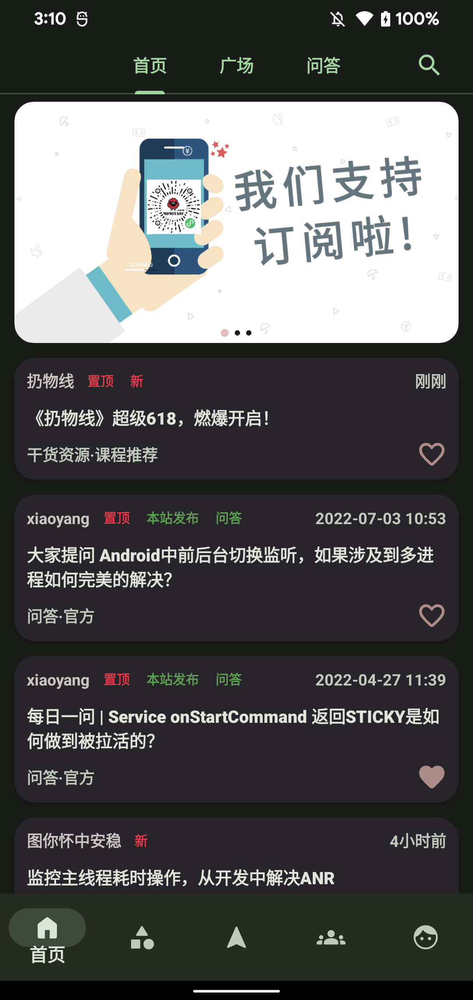 |
	
----

默认主题色采用[Material Theme Builder](https://material-foundation.github.io/material-theme-builder/)从图片取色而成。

实现[Dynamic Colors](https://m3.material.io/styles/color/dynamic-color/overview)，开启动态主题色后，App主题色自动跟随系统主题色且适配深色模式，保持一贯的视觉体验(Android 12及以上支持)

所以可交互的UI均带有Ripple效果，明确表示这是个可交互控件，且Ripple颜色支持取自当前Dynamic colors的主题色

## 逻辑：
**详细细节可转到[Design WanAndroid（WanAndroid的最佳可使用的Android客户端）](https://juejin.cn/post/7117594416235151367)**

使用buildSrc，实现全局且统一的依赖管理。

严格遵循[Android Architecture Components](https://developer.android.com/topic/libraries/architecture/)，逻辑分为：
- 界面层(UI Layer)
	- APP内实现：视图（Activity/Fragment等） + 数据驱动及处理逻辑的状态容器（ViewModel等）
- 网域层(Domain Layer) 可选项，用于处理复杂逻辑或支持可重用性吗，当你需要从不同数据源获取数据时如需要同时从数据库和接口请求数据时，推荐使用UseCase进行组合。
	- App内实现：组合或复用数据源（UseCase）
- 数据层(Data Layer)
	- App内实现：数据源（Repository）

当你采用某项东西，应是为了解决某些特定的问题，不能单纯为了用而用。在该架构下：

- 对于网络请求的需要，引入通用的网络请求库，[Retrofit](https://github.com/square/retrofit) + [OkHttp](https://github.com/square/okhttp)。

- 对于网络异常处理的需要，自定义Retrofit [NetworkResponseAdapterFactory](https://github.com/Lowae/Design-WanAndroid/tree/main/app/src/main/java/com/lowe/wanandroid/base/http/adapter)和[GsonConverterFactory](https://github.com/Lowae/Design-WanAndroid/tree/main/app/src/main/java/com/lowe/wanandroid/base/http/converter)，包装接口返回，自定义解析区分业务code，实现全局的接口错误或业务逻辑错误处理，同时下游也可按需获取错误类型。
- 针对数据层Repository需要以及UseCase需要复用并组合各类Service，引入[Hilt](https://developer.android.com/training/dependency-injection/hilt-android)，解决依赖注入问题，提高可重用性且避免强依赖。
- 对于网络请求的线程切换使用[Kotlin协程](https://developer.android.com/kotlin/coroutines?hl=zh-cn)，针对复杂且需要进行各类转换处理的数据流使用[Flow](https://developer.android.com/kotlin/flow?hl=zh-cn)，对于One-shot数据使用[LiveData](https://developer.android.com/topic/libraries/architecture/livedata?hl=zh-cn)，因为LiveData设计初衷并非用于处理复杂的响应数据流。
- 对于App内的部分需要持久化数据如[登陆状态的Cookie](https://github.com/Lowae/Design-WanAndroid/tree/main/app/src/main/java/com/lowe/wanandroid/base/http/cookie)、KV数据等小型数据引入[DataStore](https://developer.android.com/topic/libraries/architecture/datastore?hl=zh-cn)和[Kotlin Serialization](https://kotlinlang.org/docs/serialization.html)
- 对于RecyclerView引入[Paging3](https://developer.android.com/topic/libraries/architecture/paging/v3-overview?hl=zh-cn)列表的加载及状态处理
- 针对列表的多类型Item，导入并自定义修改MultiType实现[PagingMultiTypeAdapter](https://github.com/Lowae/Design-WanAndroid/blob/main/multitype/src/main/java/com/lowe/multitype/PagingMultiTypeAdapter.kt)使其能够支持配合Paging3使用

除以上主要依赖外，其他引入有[Banner](https://github.com/youth5201314/banner)和[AgentWeb](https://github.com/Justson/AgentWeb)，除此之外其余功能均自己实现。
	
## 最后:
有任何问题欢迎提Issue，如果喜欢的话也可以给个⭐Star
